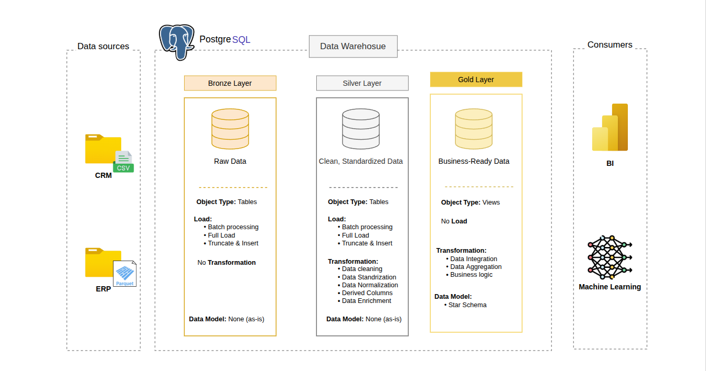
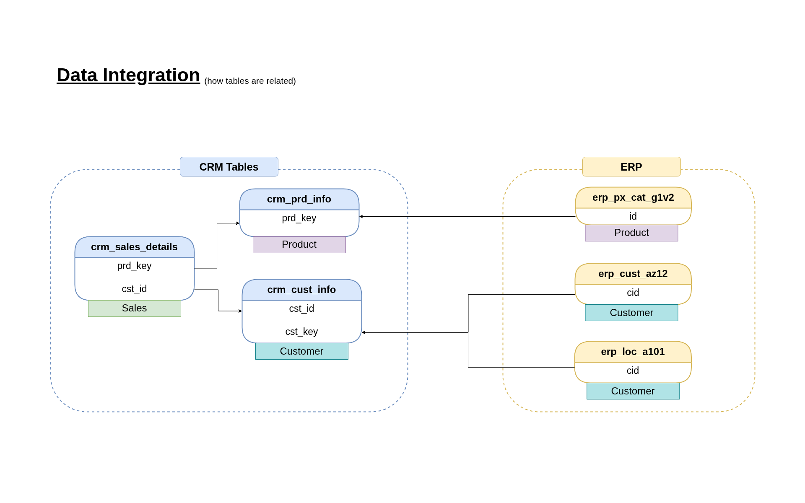
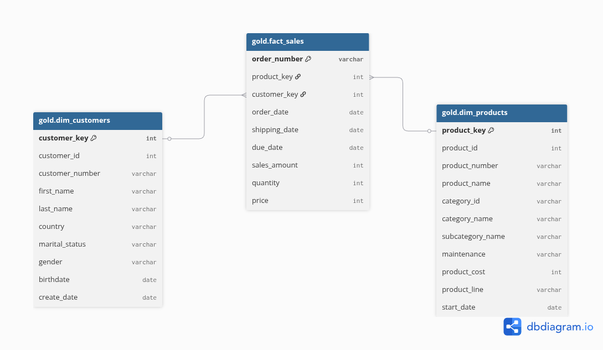

# sports-equipment-data-warehouse

## Creating data warehouse for sports equipment store with SQL using medallion architecture

This project demonstrates how to design and implement a **modern analytical data warehouse** for a sports equipment retail business using the **Medallion Architecture (Bronze → Silver → Gold)**.  

The goal is to show **how raw operational data becomes trusted, analytics-ready data** through well-defined layers, transformations, and data modeling techniques. The project focuses on **data engineering best practices** such as data quality checks, star schema modeling, and separation of concerns across layers.

**Key concepts covered:**
- **Medallion Architecture** for scalable data pipelines
- **ETL / ELT workflows** using SQL and Python
- **Data cleansing & standardization**
- **Dimensional modeling (Star Schema)** for analytics
- **Data quality validation**

## Work Flow

 * **Bronze Layer:** 
    Stores raw data ingested from the source systems CSV files from CRM and parquet files frokm ERP into SQL server Database.
* **Silver Layer:**
    Includes the transformation processes data cleansing, standardization, and normalization to prepare the data for analysis.
* **Gold Layer:**
    Houses business-ready data modeled into a star schema required for reporting and analytics.
## Data Integration


## Data Modeling



## Technologies Used
- **PostgreSQL 12** – Analytical data warehouse
- **SQL** – Data modeling, transformations, and quality checks
- **Python** – ERP data ingestion and transformation
  - Pandas

## Project Structure
```
.
├── checks                        # Data quality validation scripts
│   ├── quality_checks_gold.sql   # Gold layer consistency & integrity checks
│   └── quality_checks_silver.sql # Silver layer data quality rules
├── data                          # Raw source data (input only)
│   ├── source_crm_csv            # CRM data provided as CSV files
│   │   ├── cust_info.csv
│   │   ├── prd_info.csv
│   │   └── sales_details.csv
│   └── source_erp_parquet        # ERP data provided as Parquet files
│       ├── CUST_AZ12.parquet
│       ├── LOC_A101.parquet
│       └── PX_CAT_G1V2.parquet
├── docs                          # Architecture & documentation assets
│   ├── data_arch.png             # Medallion architecture diagram
│   ├── data_catalog.md           # Table and column definitions
│   ├── data_integration.png      # Source‑to‑target data flow
│   └── star_schema_model.png     # Gold layer dimensional model
├── README.md                     # Project overview & instructions
├── requirements.txt              # Python dependencies
└── scripts
    ├── init_DB.sh                # Database initialization helper
    ├── create_schemas.sql        # Creates bronze, silver, gold schemas
    ├── bronze                    # Raw data ingestion (Bronze layer)
    │   ├── ddl_bronze.sql        # Bronze tables DDL & procedures
    │   ├── insert_erp_bronz.py   # ERP Parquet ingestion script
    │   └── insert_crm_bronz.sql  # CRM CSV loading logic
    ├── silver                    # Cleansing & transformation (Silver layer)
    │   ├── ddl_silver.sql        # Silver tables DDL
    │   └── load_silver.sql       # Transformation & cleansing logic
    └── gold                      # Analytics layer (Gold layer)
        └── ddl_gold.sql          # Star schema views (facts & dimensions)
```

## Find Bugs?
Contributions are welcome! Please open issues or submit pull requests for improvements or bug fixes.
